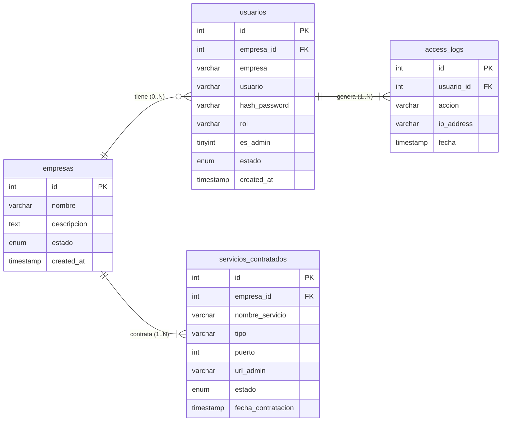

```mermaid
erDiagram
    direction LR

    empresas {
        int id PK
        varchar nombre
        text descripcion
        enum estado
        timestamp created_at
    }

    usuarios {
        int id PK
        int empresa_id FK
        varchar empresa
        varchar usuario
        varchar hash_password
        varchar rol
        tinyint es_admin
        enum estado
        timestamp created_at
    }

    servicios_contratados {
        int id PK
        int empresa_id FK
        varchar nombre_servicio
        varchar tipo
        int puerto
        varchar url_admin
        enum estado
        timestamp fecha_contratacion
    }

    access_logs {
        int id PK
        int usuario_id FK
        varchar accion
        varchar ip_address
        timestamp fecha
    }

    empresas ||--o{ usuarios : "tiene (0..N)"
    empresas ||--|{ servicios_contratados : "contrata (1..N)"
    usuarios ||--|{ access_logs : "genera (1..N)"
```
